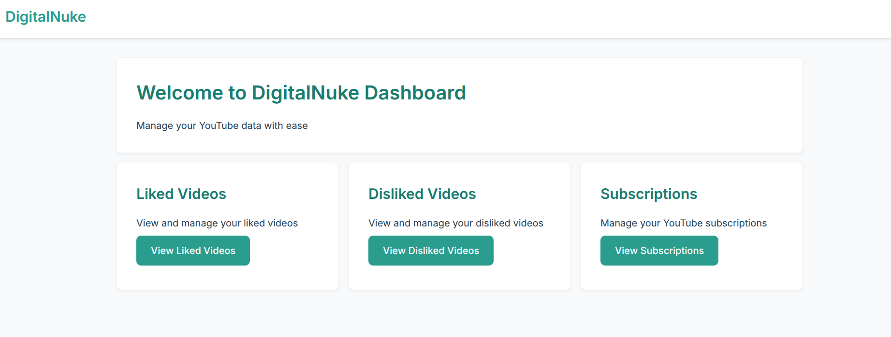

# DigitalNuke 🧹

DigitalNuke is a powerful tool designed to help users clean and manage their digital footprint across various social media platforms. Currently supporting YouTube data management, with plans to expand to other platforms.



## 🌟 Features

### Current Features
- **YouTube Integration**
  - View and manage liked videos
  - View and manage disliked videos
  - Manage channel subscriptions
  - Bulk remove all Likes and dislikes
  - Bulk remove all Subscriptions
  - Clean and organize your YouTube history

### Coming Soon
- **Multi-Platform Support**
  - Instagram data management
  - Twitter/X data cleanup
  - Facebook activity management
  - Reddit history management
- **Advanced Features**
  - Bulk actions for data cleanup
  - Data export functionality
  - Privacy analytics
  - Automated cleanup schedules

## 🚀 Getting Started

### Prerequisites
- Python 3.8 or higher
- pip (Python package manager)
- YouTube API credentials

### Installation

1. Clone the repository:
```bash
git clone https://github.com/yourusername/digital-nuke.git
cd digital-nuke
```

2. Create and activate a virtual environment:
```bash
python -m venv .venv
source .venv/bin/activate  # On Windows: .venv\Scripts\activate
```

3. Install dependencies:
```bash
pip install -r requirements.txt
```

<!-- 4. Set up your environment variables:
```bash
cp .env.example .env
# Edit .env with your credentials
``` -->

4. Run the application:
```bash
python run.py
```

## 🛠️ Technology Stack

- **Backend**: Python/Flask
- **Frontend**: HTML, CSS, JavaScript
<!-- - **Database**: SQLite (development), PostgreSQL (production) -->
- **Authentication**: OAuth 2.0
- **API Integration**: YouTube Data API v3

## 🔒 Security & Privacy

DigitalNuke takes your privacy seriously:
- No data is stored permanently
- All API calls are made directly to the respective platforms
- OAuth 2.0 authentication ensures secure access
- Regular security audits and updates

## 🤝 Contributing

We welcome contributions!
<!-- We welcome contributions! Please see our [Contributing Guidelines](CONTRIBUTING.md) for details. -->

1. Fork the repository
2. Create your feature branch (`git checkout -b feature/AmazingFeature`)
3. Commit your changes (`git commit -m 'Add some AmazingFeature'`)
4. Push to the branch (`git push origin feature/AmazingFeature`)
5. Open a Pull Request

<!-- ## 📝 License

This project is licensed under the MIT License - see the [LICENSE](LICENSE) file for details. -->

## 📞 Support

- Create an issue in the GitHub repository
<!-- - Join our [Discord community](https://discord.gg/digitalnuke) -->
<!-- - Email: support@digitalnuke.com -->

## 🌟 Roadmap

- [ ] Instagram integration
- [ ] Twitter/X integration
- [ ] Facebook integration
- [ ] Reddit integration
- [ ] Bulk actions
- [ ] Data export
- [ ] Privacy analytics
- [ ] Automated cleanup

## 🙏 Acknowledgments

- YouTube Data API
- Flask framework
- All our contributors and supporters

---

Made with ❤️ by the DigitalNuke team
